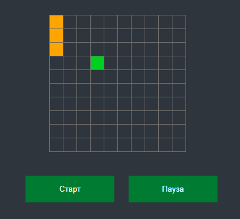

# Snake Game
## _Made with JS Classes and Love_
## About

 

## Описание
Игра Змейка -  это простая аркадная игра, которая представляет собой двумерный лабиринт, заполненный препятствиями. Цель игры - построить змейку как можно длиннее, пройдя через лабиринт и поедая желтые квадратики. Игрок проигрывает, если его змея сталкивается со стеной или собственным хвостом. Змейка может двигаться во всех направлениях, а также менять направление движения в любое время. Змейка управляется с клавиатуры

## Демо
Проект можно посмотреть по адресу https://DEValtermaRRin.github.io/snake

## Используемые технологии
1. HTML5
2. CSS3
3. JavaScript
